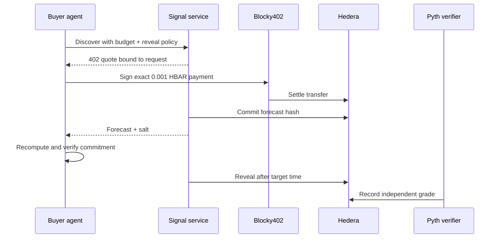

# Signal Market

### Proof before trust for agent-bought DeFi forecasts

[](https://hashscan.io/testnet)
[](https://www.x402.org/)
[](#verification)

Signal Market is an agent-native marketplace for private, time-bound forecasts. A buyer discovers a provider, pays `0.001 HBAR` through x402, verifies an on-chain commitment, and later inspects the public reveal and Pyth-backed grade.

Payment buys a valid forecast—not a promise that it is correct. Reveal coverage and forecast quality stay separate, so an oracle outage cannot rewrite payment or disclosure history.

**ETHOnline 2026 · Hedera AI & Agentic Payments**

[Open the live demo](https://leader-descriptions-announcements-seat.trycloudflare.com) · [Inspect the verified signal](https://leader-descriptions-announcements-seat.trycloudflare.com/v1/signals/0x10d7ceb8b712edbe1738d0405e3b9b448610642353af3b4e672ca11b4a5158dc) · [Read the API contract](docs/openapi.yaml) · [Follow the recording script](docs/demo-script.md)

> The demo URL is a temporary Cloudflare tunnel served from the operator machine. The on-chain evidence remains independently available if the tunnel is offline.

## The problem

Agents can buy market data in milliseconds, but they cannot tell whether a seller produced a forecast before the outcome, reliably discloses expired forecasts, or selectively hides bad calls.

Signal Market creates a public evidence trail without forcing providers to reveal their model:

1. **Discover** — the buyer filters providers by price, history, and reveal coverage.
2. **Pay** — Blocky402 settles one exact HBAR transfer on Hedera.
3. **Commit** — the forecast hash is anchored before the target time.
4. **Reveal** — any holder can publish the exact payload after expiry.
5. **Grade** — a separate Pyth-backed operation records error and direction.

## Why Hedera

This is not a logo integration. Hedera is the trust and settlement layer:

- x402 payment settles in HBAR through the Blocky402 facilitator.
- `AgentRegistry` publishes provider identity, endpoint, payee, and metadata hash.
- `SignalLedger` records commitments, reveals, and grades as independent states.
- HCS carries non-secret audit receipts.
- Mirror Node reconstructs payment and contract evidence for the public indexer.
- HCS-14 metadata makes the service discoverable to other agents.



## Live proof

The public index currently contains three real paid forecasts, three reveals, and one current-ledger grade.

| Evidence   | Verified result                                                                                                           |
| ---------- | ------------------------------------------------------------------------------------------------------------------------- |
| Payment    | `100000` tinybars from buyer `0.0.10384426` to provider `0.0.10384424`                                                    |
| Commitment | [`0x0f7f…fd`](https://hashscan.io/testnet/transaction/0x0f7fdd8c28fb326bf2e8fb677bc74717f86bd95add9251f109f5d4e0fd3484fd) |
| Reveal     | [`0x7586…de`](https://hashscan.io/testnet/transaction/0x75864d79367acc3038da10803a47ed83b09ea2f7ab37b3908793b9d1b49e52de) |
| Grade      | [`0xfd1b…ba`](https://hashscan.io/testnet/transaction/0xfd1becd8e2d3dc15f6fb48fef1eaa67b71e89cf6f50f6e87c4437e1cb023dba)  |
| Result     | predicted `-3` bps, actual `-17` bps, absolute error `14` bps                                                             |
| Aggregate  | 3/3 revealed, `100%` reveal coverage, 1/3 graded                                                                          |

Contracts and deployment IDs are recorded in [`deployments/testnet.json`](deployments/testnet.json). The current `SignalLedger` is [`0x2B90…9E2B`](https://hashscan.io/testnet/contract/0.0.10387543), and the project-operated Pyth verifier is [`0x0B38…8b63`](https://hashscan.io/testnet/contract/0.0.10387542).

## Run locally

Requires Node.js `>=22.13.0`.

```sh
npm ci
cp .env.example .env
chmod 600 .env
# Add Hedera testnet accounts and deployed addresses to .env
npm run compile
npm run check
npm start
```

Open [http://127.0.0.1:3000](http://127.0.0.1:3000).

Read-only checks:

```sh
curl -fsS http://127.0.0.1:3000/health
curl -fsS http://127.0.0.1:3000/v1/agents
curl -fsS http://127.0.0.1:3000/v1/agents/1/signals
```

The buyer rejects providers with fewer than five eligible samples by default. A deliberate testnet purchase uses the explicit exploratory flag and can spend `0.001 HBAR`:

```sh
npm run buyer -- --allow-unproven
npm run buyer -- --resume 0xREQUEST_ID  # recover; never pays again
npm run buyer -- --kill                 # persistent emergency stop
```

Do not run the purchase command during review unless another paid signal is intended. Never record or commit `.env`, private keys, signed payment payloads, or unrevealed forecast storage.

## Repository map

```text
contracts/   AgentRegistry, SignalLedger, oracle grading, subscription contracts
src/         HTTP service, buyer, durable worker, indexer, protocol and adapters
web/         public marketplace, network activity and evidence explorer
scripts/     deployment, seller operations, preflight and receipt-backed evidence
test/        protocol, service, adapter and Solidity checks
docs/        API, acceptance matrix, demo, live evidence and honest limitations
```

## Verification

```sh
npm run check          # typecheck + unit + contract + UI checks
npm run test:coverage  # enforced 80% statement and line floor
```

Latest verified local result: **109 unit tests + 31 contract tests passing**, plus **10 UI contract checks**, with **94.48%** statement and line coverage. Sourcify reports exact runtime matches for the registry and ledger; creation-bytecode matches remain unclaimed. See the [acceptance matrix](docs/acceptance.md) and [status report](docs/status-report.md) for the evidence boundary.

## Hackathon disclosure

This project was started during ETHOnline 2026. The Git history records the build from the first Hedera vertical slice through the service interfaces, oracle recovery, subscriptions, and submission polish. No pre-existing project-specific code was used.

AI tools assisted with implementation, test generation, code review, documentation, and UI iteration. The product decisions, protocol invariants, live testnet operations, evidence acceptance, and final submission choices were directed and verified by the human builder. The design and requirements artifacts are included in [`final-system-design.md`](final-system-design.md) and [`requirements-spec.md`](requirements-spec.md).

## Honest limitations

- The public URL is a temporary tunnel, not permanent hosting.
- The rotating quick-tunnel URL has not been republished to on-chain provider metadata; do that only when a stable endpoint is available.
- Two legacy forecasts remain revealed but ungraded because the legacy Pyth contract rejects current proofs; they are not silently regraded.
- The current verifier is built from pinned upstream Pyth source and is project-operated, not an official Pyth deployment or endorsement.
- Subscription contracts and two manual settlements are live, but recurring scheduled settlement hit a two-second timestamp skew. The tested fix is not deployed, so P1 automation is not claimed.
- The Agent Card is discovery metadata, not full A2A RPC interoperability.
- This is testnet software, not financial advice, custody, or an automated trading system.

Detailed evidence: [current oracle recovery](docs/evidence/pyth-pro-recovery.md) · [UI validation](docs/ui-validation.md) · [verification jobs](docs/evidence/verification-jobs.json) · [P1 boundary](docs/p1-parallel-plan.md)
