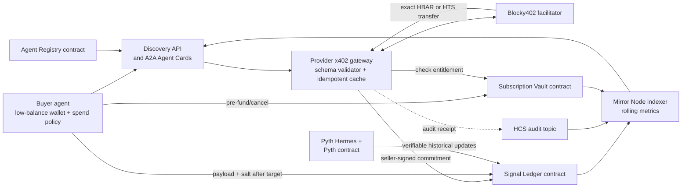

# Verifiable DeFi Signal Market on Hedera

## Final, financially safe system design for ETHOnline 2026

**Status:** refined design, 2 September 2026  
**Target:** ETHOnline 2026, Hedera “AI & Agentic Payments” track  
**Scope:** machine-readable DeFi forecasts sold to autonomous agents

## 1. Executive decision

Build a **DeFi signal access marketplace**, not a generalized “AI IP marketplace.” Providers keep their models, pipelines, prompts, data sources, and orchestration private. What buyers purchase is a time-bound output from a service.

The MVP has two payment paths:

1. **Pay per signal:** the buyer pays the provider directly through a real x402 request settled on Hedera by the Blocky402 facilitator.
2. **Subscription:** the buyer pre-funds a non-custodial vault. Provider earnings accrue linearly with time; a buyer can cancel at any time and recover the unearned balance. Hedera scheduled contract calls checkpoint the accrued payment, but are not allowed to become a withdrawal or cancellation dependency.

Quality is deliberately separate from payment:

- payment is for delivering a schema-valid signal;
- a later oracle-backed grade measures whether the forecast was useful;
- a bad forecast never causes a refund, slash, or seizure;
- no seller stake, DAO, human evaluator, World ID, insurance pool, or accuracy threshold is needed;
- buyers choose providers using transparent raw metrics rather than a protocol-defined “trust score.”

This is the smallest architecture that preserves the important product idea, demonstrates Hedera-specific depth, and limits every buyer’s possible loss before a transaction is signed.

## 2. What the Gemini conversation actually finalized

The conversation moved through several designs before converging. The decisions worth retaining are:

- start with DeFi because forecast outcomes can be evaluated objectively;
- publish one protocol-defined, versioned signal schema so buyer and seller agents interoperate without key-name guessing;
- support both request pricing and subscription pricing;
- separate output validity from output quality;
- use commit-reveal so the forecast is timestamped before its target time without publishing the alpha early;
- use oracle-backed metrics and let buyers define their own acceptance thresholds;
- do not slash providers for inaccurate forecasts, malformed output, downtime, or non-reveal;
- do not introduce human evaluators, World ID, a DAO, or a generalized evaluator marketplace in v1.

The supplied `A2A ETH Online.md` captures most of that final direction, but four parts need correction:

1. **x402 is not the proposed deferred escrow.** Blocky402’s Hedera `exact` scheme settles a partially signed transfer to the advertised `payTo` account. The normal x402 flow verifies and settles payment before returning the resource. A later `revealAndGrade` call cannot release that same payment unless a different, custom escrow payment mechanism is built. That would not be the simple Blocky402 path required by this sponsor track.
2. **HCS is not smart-contract storage.** Contracts do not read arbitrary HCS topic history. HCS is excellent for public audit messages retrieved through a Mirror Node, but the commitment needed by grading logic must be stored in a contract. HCS should contain a redundant audit receipt, not be the contract’s source of truth.
3. **A bad permissionless reveal must not harm reputation.** If any caller can submit `(payload, salt)`, an attacker can submit random mismatches. A mismatch must revert or be ignored with no state change. It cannot increment a seller “integrity violation.”
4. **A recurring schedule is not free.** HIP-1215 allows contracts to schedule future calls and recursively reschedule themselves, but schedule capacity, gas, and HBAR funding still matter. Manual `checkpoint`, `claim`, and `cancel` functions must remain available.

## 3. Product boundary

### What is sold

A provider sells non-exclusive access to a signed, time-bound forecast such as:

> “From the ETH/USD price observed at issuance, the predicted return at the target timestamp is +42 basis points.”

The protocol does **not** sell ownership of the model or other IP. It does not execute trades, custody a trading portfolio, promise returns, or decide whether a forecast is safe to act on.

### Supported v1 task

Use one task family only:

`defi.return_forecast.v1`

Support a small allowlist of Pyth price-feed IDs and horizons, for example ETH/USD and BTC/USD at 5-minute and 1-hour horizons. The short horizon makes the complete commit-to-grade lifecycle demonstrable during judging.

Signals are non-exclusive. Preventing a paying buyer from redistributing a signal is outside the protocol’s guarantees and must not be claimed.

## 4. Architecture



### On-chain components

#### A. Agent Registry

Purpose: ownership, endpoint binding, and discovery anchors.

Store only:

- `agentId`;
- owner address and payment recipient;
- active/inactive status;
- HCS-14 UAID string or hash;
- metadata URI and metadata hash;
- supported schema ID;
- supported payment modes.

The metadata document contains the HTTPS endpoint and A2A Agent Card URL. Keep large descriptions and ranking data out of contract storage.

HCS-14 is currently a draft, so describe it accurately as a UAID format used by the project, not as a Hedera-native identity issuance service. ERC-8004 is a viable later alternative, but deploying its full identity and reputation registries adds little to this MVP.

#### B. Signal Ledger

Purpose: objective, immutable evidence for commitments and grades.

Core operations:

- `commit(requestId, agentId, schemaId, signalHash, targetTime, priceFeedId, paymentRef)`
- `revealAndGrade(requestId, signal, salt, pythUpdateAtIssue, pythUpdateAtTarget)`

Rules:

- only the registered provider or its delegated gateway may commit;
- the contract uses consensus time as the authoritative commit time;
- the payload's `issuedAt` must be within a small fixed tolerance of that commit time, while grading uses the stored commit time for the issuance-price window;
- `targetTime` must be at least the schema’s minimum horizon in the future and no farther than its maximum horizon;
- `paymentRef` is unique, but its x402 validity is verified by the indexer against Mirror Node transfer data because the contract cannot query past Hedera transfers;
- reveal is permissionless;
- a hash mismatch reverts and changes no state;
- the first valid reveal finalizes the request; later reveals are idempotently rejected;
- an oracle update outside the fixed time window, with invalid price, or with excessive confidence width marks the sample `oracle_unavailable` and excludes it from quality metrics;
- grading changes reputation evidence only. It never transfers buyer or seller funds.

The contract emits raw grade events. It does not maintain an expensive rolling array or a single score.

#### C. Subscription Vault

Purpose: bounded, prepaid, cancellable subscriptions without holding buyer keys or granting an unlimited allowance.

Each subscription fixes:

- buyer, provider, and settlement token;
- rate per second;
- start and maximum end time;
- total prepaid amount;
- amount already paid to the provider;
- cancellation state;
- capped HBAR automation reserve.

Provider entitlement accrues linearly:

`earned = min(deposit, ratePerSecond × (effectiveEnd - start))`

where `effectiveEnd` is the earlier of the current time, cancellation time, or maximum end time.

`checkpoint()` pays only newly accrued value. The function is permissionless and idempotent. A HIP-1215 scheduled call invokes it at each epoch boundary and schedules the next checkpoint. If scheduling is unavailable or out of capacity, anyone can call it manually. The seller is naturally motivated to do so.

`cancel()` first settles accrued value, marks the subscription cancelled, and returns every unearned token plus the unused automation reserve to the buyer. Rounding is in the buyer’s favor. A scheduled call that arrives after cancellation is a no-op.

The provider authorizes requests by checking the vault entitlement and verifying a wallet-signed nonce from the subscriber. Cancellation and refunds never depend on the provider backend.

### Off-chain components

#### D. Provider x402 Gateway

Purpose: expose the provider’s private service through the sponsor-required payment flow.

Responsibilities:

- publish a well-known A2A Agent Card and schema ID;
- return x402 v2 payment requirements for `hedera:testnet` using the Blocky402 `exact` scheme;
- ask Blocky402 to verify the buyer’s payment payload;
- generate and schema-validate the forecast before settlement;
- settle only after generation succeeds;
- create the on-chain commitment before releasing the response;
- return the signal, random salt, request ID, payment receipt, and commitment transaction ID over HTTPS;
- cache that response by payment transaction/request ID so a buyer can safely retry after an HTTP failure without paying twice.

The split `verify → compute/validate → settle → commit → respond` limits the chance of charging for a failed generation. It is not atomic: settlement can succeed while the final HTTP response is lost. Idempotent retrieval is therefore a required safety feature, not optional polish.

#### E. Audit Writer and HCS topic

Purpose: sponsor-visible, append-only payment and signal receipts.

After commitment, write a compact message containing:

- version and event type;
- request ID and agent ID;
- x402 settlement transaction ID;
- Signal Ledger transaction ID;
- commitment hash;
- schema ID and target timestamp.

Do not publish the signal or salt before the target time. The HCS message is a public audit copy. Contract state remains authoritative for grading.

#### F. Evaluator/keeper

Purpose: improve grading coverage, not control settlement.

At the target time it fetches historical Pyth update data from Hermes and calls `revealAndGrade` with the cached signal and salt. The seller and buyer can call the same function, so keeper failure does not block money or permanently block grading.

No keeper bounty is needed in the MVP. The seller benefits from a grade and the buyer already possesses the reveal data.

#### G. Indexer and Discovery API

Purpose: turn raw public evidence into useful marketplace views.

It reads contract events, HCS messages, schedules, and transfers from a Hedera Mirror Node. It verifies that a claimed `paymentRef` actually transferred the expected asset and amount to the registered provider, then computes rolling views such as the latest 100 verified paid forecasts or trailing 30 days.

The API returns raw metrics and supporting transaction links. Ranking is a UI default, not protocol truth.

## 5. Canonical signal schema

Use integers and identifiers, not floating point strings:

```json
{
  "schema": "defi.return_forecast.v1",
  "request_id": "0x32-byte-id",
  "agent_id": "42",
  "price_feed_id": "0x-pyth-feed-id",
  "issued_at": 1788361200,
  "target_time": 1788361500,
  "predicted_return_bps": 42,
  "model_version": "provider-defined-short-id",
  "distribution": "non-exclusive"
}
```

Canonicalization rules must specify field order/ABI encoding, integer widths, signedness, timestamp units, and UTF-8 normalization. Compute:

`signalHash = keccak256(abi.encode(schemaId, requestId, agentId, priceFeedId, issuedAt, targetTime, predictedReturnBps, modelVersionHash, distributionCode, salt))`

The buyer recomputes the hash from the delivered payload and verifies the contract commitment before using the signal.

## 6. Grading and reputation

### Oracle procedure

The grader supplies two authenticated Pyth updates: the first update in a narrow window at issuance and the first update in a narrow window at the target. Pyth’s `parsePriceFeedUpdatesUnique` is intended for a fixed historical time and prevents a caller from choosing a later, more favorable update within the permitted interval.

Let:

- `p0` be the verified issuance price;
- `p1` be the verified target price;
- `actualReturnBps = ((p1 - p0) × 10,000) / p0`;
- `absoluteErrorBps = abs(predictedReturnBps - actualReturnBps)`;
- `directionCorrect = sign(predictedReturnBps) == sign(actualReturnBps)`, with an explicit neutral band in the schema.

### Public metrics

For each provider and schema, show:

- verified paid sample count;
- directional hit rate;
- mean absolute return error in basis points;
- grade coverage: valid grades / verified paid commitments;
- oracle-excluded sample count;
- unique paying wallets as an untrusted demand signal.

Do not combine these into one “trust score.” Do not rank primarily by volume or unique wallets because self-payment and Sybil buying cannot be eliminated permissionlessly. Buyers can set requirements such as “at least 30 paid samples, coverage above 90%, and MAE below 35 bps.”

RMSE is omitted from the MVP because it overweights outliers and is harder for buyers to interpret. Confidence calibration and Brier score should wait until the schema requires probabilistic forecasts and enough samples exist.

There is no lifetime “integrity violation” counter. A wrong reveal from any caller simply fails. Selective non-reveal appears as reduced coverage, while the buyer and keeper can reveal the exact payload they received.

## 7. End-to-end flows

### Pay per signal

1. Buyer discovers a provider and reads its Agent Card, schema, price, payee, and raw metrics.
2. Buyer calls the signal endpoint and receives HTTP 402 payment requirements.
3. Buyer policy verifies the Hedera network, exact asset, amount, payee, expiry, and spending caps before signing.
4. Blocky402 verifies the partially signed Hedera transfer.
5. Provider computes the forecast, validates the canonical schema, creates a salt, and caches the response.
6. Blocky402 co-signs as fee payer and settles the exact transfer to the provider.
7. Provider submits the commitment to Signal Ledger, referencing the x402 transaction.
8. Provider returns the signal and salt. The buyer verifies the commitment locally.
9. After the target time, keeper, buyer, or seller submits the reveal plus historical Pyth proofs.
10. Signal Ledger emits the objective grade; the indexer refreshes discovery metrics.

Payment is final after step 6. Steps 7–10 cannot debit the buyer or slash the seller.

### Subscription

1. Buyer approves exactly the intended HTS amount and creates a vault subscription with a fixed maximum end time.
2. Vault transfers the deposit in and schedules the first checkpoint.
3. Buyer signs a nonce-bearing API request; provider verifies the wallet and active entitlement.
4. Scheduled or manual checkpoints transfer only accrued value to the provider.
5. Buyer cancels at any time. Accrued value is settled and the remaining tokens are refunded in the same transaction.
6. Any later scheduled checkpoint is harmless.

Subscription outputs can use the same commit/reveal path. Discovery labels their source as `subscription`; v1 does not require every unmetered subscription call to be graded.

## 8. Financial safety invariants

These are product requirements, not optional recommendations:

- Use Hedera **testnet only** for the hackathon.
- The buyer agent uses a purpose-created, low-balance wallet. It never receives a user’s main wallet key.
- Every x402 request has a per-request cap, per-provider daily cap, global daily cap, token allowlist, network allowlist, and kill switch.
- The client signs only an exact amount, exact asset, exact `payTo`, and short expiry. It rejects changed requirements on retry.
- There is no unlimited token allowance. A subscription approval equals its deposit and is cleared after funding where the wallet supports it.
- A provider can never withdraw more than accrued subscription value.
- Cancellation and refund paths remain callable even when new purchases or scheduled execution are paused.
- Oracle failure, keeper failure, poor accuracy, malformed reveals, and HCS failure cannot move buyer funds.
- No contract owner rescue function may withdraw accounted subscriber balances.
- The vault must explicitly handle HTS association and transfer failures; accounting state changes only after a successful token transfer.
- Existing prices and subscription terms are immutable; price changes require a new purchase or subscription.
- Protocol fee is **0% in the MVP**. Add a fee only after the payment and accounting invariants have tests and an audit.

Before any mainnet deployment: independent contract review, invariant/fuzz testing, rate limits, monitored pause controls, multisig administration, explicit token/account-association handling, and a published risk disclosure are mandatory.

## 9. Threat model and honest limitations

| Risk | v1 treatment |
|---|---|
| Seller commits after seeing the outcome | Contract requires target time to be sufficiently after consensus commit time. |
| Caller selects a favorable oracle observation | Parse Pyth’s first authenticated update in a fixed narrow time window. |
| Oracle stale/uncertain | Exclude the sample; never alter payment. |
| Random caller submits wrong reveal | Revert with no reputation state change. |
| Seller withholds reveal | Buyer and keeper already possess payload and salt; coverage is visible. |
| HTTP response lost after payment | Idempotent, receipt-keyed retrieval returns the same cached response without another payment. |
| x402 replay or altered quote | Unique request ID, short expiry, exact signed terms, facilitator verification, and settlement lookup. |
| Fake payment references or self-purchases | Indexer verifies transfers; paid sample count is separate from accuracy; demand metrics are not treated as trust. |
| Buyer leaks/resells a signal | Unsolved by cryptography after delivery; all v1 signals are explicitly non-exclusive. |
| Provider endpoint compromised | Owner can deactivate/delegate endpoint; old commitments remain auditable. |
| Scheduled call fails or lacks gas | Manual permissionless checkpoint/cancel remains available; no funds are locked behind automation. |
| Platform/indexer lies about ranking | Raw contract/HCS/transfer evidence is linked so another indexer can reproduce metrics. |

## 10. Explicitly cut from the MVP

- accuracy-conditioned escrow and refunds;
- seller stake, slashing, insurance, or compensation for trading losses;
- DAO or decentralized court;
- human/LLM evaluator marketplace and World ID;
- generalized task schemas and pluggable evaluators;
- model-execution proofs, TEEs, and zkML;
- end-to-end payload public-key encryption beyond HTTPS;
- custom royalty graphs and composite-agent revenue splitting;
- protocol token and token-governance system;
- automated trading or custody of buyer portfolios;
- cross-chain identity or payments.

## 11. Build order for the hackathon

### Required to qualify and tell the full story

1. One live provider endpoint using x402 v2 on Hedera testnet through Blocky402.
2. One buyer agent with visible policy checks completing a real paid request.
3. One fixed `defi.return_forecast.v1` schema and deterministic canonical encoder.
4. Agent Registry and Signal Ledger contracts deployed and verified.
5. One real commitment and one Pyth-backed historical grade.
6. Discovery page showing raw metrics and links to payment, commitment, grade, and HCS receipt.
7. Public repository, architecture/payment-flow README, and a demo video under five minutes.

### Add only after the core loop works

8. Subscription Vault with cancellation and manual checkpoint tests.
9. HIP-1215 self-scheduled checkpoint.
10. HCS-14 UAID and A2A Agent Cards for two providers.

The current Hedera bounty explicitly requires a live x402-gated service settled through Blocky402 and a real end-to-end paid request. Identity, HCS receipts, HTS tokens, A2A, discovery, and Scheduled Transactions are extra points. Therefore, the pay-per-signal loop must work before subscription automation or generalized marketplace polish.

## 12. Verified implementation facts and sources

- [ETHOnline 2026 Hedera prize requirements](https://ethglobal.com/events/ethonline2026/prizes): live x402 service, Blocky402 settlement, consuming agent/platform, public repo, and demo; lists the relevant extra-credit integrations.
- [Hedera’s x402 flow](https://hedera.com/blog/hedera-and-the-x402-payment-standard/): the buyer creates a partially signed transfer, the facilitator verifies and co-signs for fees, settlement completes, then the server returns the resource.
- [Blocky402 networks and assets](https://blocky402.com/docs/networks/): hosted Hedera testnet support for HBAR and HTS tokens and the `hedera:testnet` network identifier.
- [Blocky402 API](https://blocky402.com/docs/api-reference/): x402 v2, Hedera’s partially signed `TransferTransaction`, fee-payer requirements, and `/verify`/settlement behavior.
- [HIP-1215](https://github.com/hiero-ledger/hiero-improvement-proposals/blob/main/HIP/hip-1215.md): finalized generalized scheduled contract calls, recursive scheduling, capacity checks, payer rules, and failure codes.
- [Hedera Scheduled Transactions](https://docs.hedera.com/hedera/core-concepts/scheduled-transaction): best-effort execution, signatures, expiry behavior, and the maximum future scheduling window.
- [Hedera HCS Mirror Node API](https://docs.hedera.com/api-reference/topics/list-topic-messages-by-id): HCS messages are retrieved from topic history through Mirror Node APIs.
- [Pyth EVM contract addresses](https://docs.pyth.network/price-feeds/core/contract-addresses/evm): Pyth contract availability on Hedera mainnet and testnet.
- [Pyth historical price workflow](https://docs.pyth.network/price-feeds/core/use-historical-price-data): timestamped Hermes updates should be parsed on-chain rather than treated as the current price.
- [Pyth `parsePriceFeedUpdatesUnique`](https://api-reference.pyth.network/price-feeds/evm/parsePriceFeedUpdatesUnique): obtains the first authenticated update in a specified publish-time range.
- [HCS-14 specification](https://hol.org/docs/standards/hcs-14/): UAID structure and current **Draft** status.
- [ERC-8004](https://eips.ethereum.org/EIPS/eip-8004): identity, reputation, and validation registries; payments remain orthogonal and Sybil-resistant aggregation is outside the base standard.

## Final architecture sentence

**A buyer-controlled agent discovers a provider, pays an exact capped x402 charge on Hedera for a schema-valid DeFi forecast, verifies its pre-outcome commitment, and later reads an oracle-backed public grade—while subscriptions can never spend more than their prepaid vault and prediction quality can never seize anyone’s funds.**
